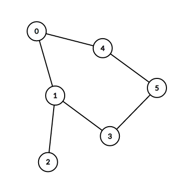

# Rendu TP Akka Actors
Réalisé par Jonathan Lecointe et Louis Guilbert

26/03/2017

---

## Introduction
Ce logiciel utilise la librairie akka afin de diffuser un message dans un graph.
Il crée deux systèmes distant et une console locale afin de créer les noeud d'un graph, définir les liaisons du graph et envoie un message à un noeud du graph.
Ce message est alors transmit à tous les autres noeuds du graph de voisin en voisin.

### Executer le code :
chaque systeme est à lancer sur un terminal différent.
La console doit être lancé après les 2 autres systèmes.
```
sbt
> run sys1
```

```
sbt
> run sys2
```

```
sbt
> run console
```

### Executer les tests : 
```
sbt
> test
```

## Architecture

### Général
Nous avons réalisé un main qui crée le système demandé en paramètre.
Le système 1 est créé par le paramètre sys1 et crée les noeuds 0, 1 et 2.
Le système 2 est créé par le paramètre sys1 et crée les noeuds 3, 4 et 5.
La console est créé par le paramètre consoke et crée les liens entre les noeuds via des messages.
Le graph resemble alors à ceci : 



### Code Samples
```
case TextMessage(res) =>
	if(!visited) {				
		println("Node " + id + " valeur : " + res)
		neighbours.map { n =>
		  context.actorSelection(n) ! TextMessage(res + 1)
		}
		visited = true
	}
```
Pour éviter la boucle infini due a la propagation des message, nous utilisons un boolean passé à true lorsqu'un message est reçu.
Cela ne permet pas d'envoyer plusieurs messages. Un autre système utilisant un identifiant dans le message envoyé aurait pu permettre l'envoie de plusieurs message, mais la console n'étant pas interactive, nous n'avons pas trouvé cela intéressant d'implémenter un tel système.